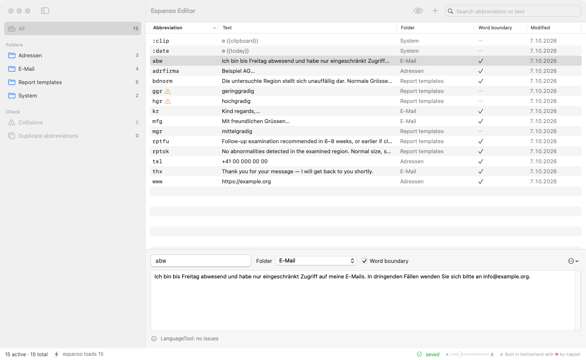
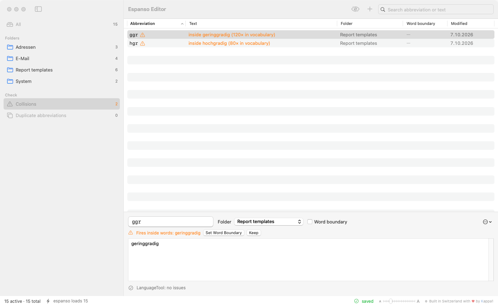

# Espanso Editor

A native macOS editor for your [espanso](https://espanso.org) snippets — folders like Typinator, one searchable table,
spell checking, and a check for abbreviations that fire in the middle of real words.

*Unofficial. Not affiliated with the espanso project — it only reads and writes espanso's YAML files.
Typinator is a trademark of Ergonis Software; this project is not affiliated with Ergonis.*

[Deutsch weiter unten](#deutsch)



## Features

- **Folders = files.** Every `.yml` in espanso's `match/` folder is a folder in the sidebar. Rename, create, switch off
  (prefix `_`, espanso then ignores the file) — no YAML editing needed. Drag snippets onto a folder to move them;
  drag folders to reorder them (the order is stored with the snippets in `match/_bausteine/`).
- **One table, instant search** across all folders, showing where each hit lives. Search abbreviations and text, only
  abbreviations or only the expansion text, optionally as a whole word (`hgr` then no longer finds “hochgradig”).
- **Saves as you type.** The change is active in espanso about a second later. If your snippets live in a git
  repository, the editor commits and pushes after 30 s of quiet (or ⌘S, or when you quit).
- **Your comments stay.** Unchanged entries are written back byte for byte; only edited entries are re-generated.
  Before anything touches the disk, the new file is parsed again and compared with what it must contain, and afterwards
  `espanso match list` must report the same number of snippets — otherwise the change is rolled back.
- **Spell checking:** macOS (typos) always; optionally [LanguageTool](https://languagetool.org) for grammar and
  punctuation (free API or your Premium key; text is sent to languagetool.org only when you switch it on).
- **Collisions:** abbreviations without word boundary that fire inside words you actually write (e.g. `dt` inside
  “Stadtpark”). Sources: a shared protection list (`match/_bausteine/schutzwoerter.txt`) and an optional local
  vocabulary built from your own texts. One click: set word boundary, rename, or keep.
- **Adapt case** per snippet (espanso `propagate_case`): at the start of a sentence type `Ggr` and get “Geringgradig”;
  off means only the exact abbreviation fires. On for new snippets; abbreviations with capital letters (`MDT`) stay exact.
  Switch several at once from the context menu.
- Duplicate abbreviations, entries with variables/forms editable as raw YAML, import (CSV, espanso YAML, running
  Typinator), export (ZIP in espanso format, CSV), font size slider (⌘+ / ⌘− / ⌘0).
- **English and German** user interface, following the macOS language.



## Install

1. Download `EspansoEditor-<version>-macOS.zip` from [Releases](../../releases), unzip, move **Espanso Editor.app** to
   *Applications*.
2. The app is not notarized (no Apple developer account). On first launch macOS blocks it: open
   *System Settings › Privacy & Security* and click **Open Anyway** — or run
   `xattr -dr com.apple.quarantine "/Applications/Espanso Editor.app"`.

Requires macOS 14 or later and an installed espanso.

## Double Backspace

espanso reverts an expansion on the *first* Backspace (`undo_backspace`). A patch that adds
`undo_backspace_presses: 2` (revert only on two quick presses) plus fixes for related Backspace issues lives in
[3v3nFloW/espanso, branch `kappa1`](https://github.com/3v3nFloW/espanso/tree/kappa1) and is offered upstream as pull requests
([#2826](https://github.com/espanso/espanso/pull/2826), [#2827](https://github.com/espanso/espanso/pull/2827), [#2828](https://github.com/espanso/espanso/pull/2828), [#2829](https://github.com/espanso/espanso/pull/2829), [#2830](https://github.com/espanso/espanso/pull/2830)).

## Build from source

Command Line Tools are enough (no Xcode):

```sh
./scripts/app-bauen.sh                 # → build/Espanso Editor.app
./scripts/app-bauen.sh --installieren  # → /Applications
swift scripts/icon-bauen.swift "$PWD"  # app icon from Resources/icon-entwuerfe.jpg
```

The macOS 27 SDK of the Command Line Tools turns `@State` into a macro whose plugin only ships with Xcode, so the script
builds against the newest macOS 26 SDK.

Self-tests (read-only on your files, or against a throw-away copy):

```sh
SDKROOT=…/MacOSX26.5.sdk swift run kern-pruefung [match-folder]   # round-trip of every entry, CSV
git clone --bare <repo> /tmp/t/gegenstelle.git && git clone /tmp/t/gegenstelle.git /tmp/t/espanso
ESPANSO_CONFIG_DIR=/tmp/t/espanso BAUSTEINE_KEIN_NEUSTART=1 swift run store-pruefung
```

## Contributing

The code (identifiers and comments) is written in German, the user interface is English and German
(`Sources/BausteineKern/Sprache.swift`). Issues and pull requests in English are welcome.

## License

GPL-3.0-or-later — see [LICENSE](LICENSE).

---

## Deutsch


Ein Mac-Editor für deine espanso-Bausteine: Ordner wie bei Typinator, eine durchsuchbare Tabelle,
Rechtschreibprüfung und eine Prüfung auf Kürzel, die mitten in echten Wörtern auslösen. *Inoffiziell, nicht vom
espanso-Projekt. Typinator ist eine Marke von Ergonis Software; dieses Projekt steht in keiner Verbindung zu Ergonis.*

- **Suche** über alle Ordner: Kürzel und Text, nur Kürzel oder nur Text, auf Wunsch als ganzes Wort.
- **Ordner = Datei** in `match/`; ausschalten = `_` vor dem Dateinamen. Bausteine per Ziehen verschieben, Ordner per Ziehen umsortieren.
- **Speichert beim Tippen**, nach etwa 1 s in espanso aktiv; liegt der Ordner in einem git-Repo, wird nach 30 s Ruhe
  committet und gepusht.
- **Kommentare bleiben erhalten**; jede Datei wird vor dem Schreiben gegengeprüft, danach muss espanso gleich viele
  Bausteine laden, sonst wird zurückgenommen.
- **Rechtschreibung:** macOS (Tippfehler) immer, LanguageTool (Kommas, Grammatik) auf Wunsch.
- **Kollisionen:** Schutzliste (`match/_bausteine/schutzwoerter.txt`) und eigener Wortschatz aus alten Texten.
- **Oberfläche** Deutsch oder Englisch, je nach Systemsprache.
- **Installation:** ZIP aus den Releases, App nach *Programme*; beim ersten Start unter *Systemeinstellungen ›
  Datenschutz & Sicherheit* auf **Trotzdem öffnen** klicken (die App ist nicht notarisiert).

Built in Switzerland with ♥ by Kappa1
